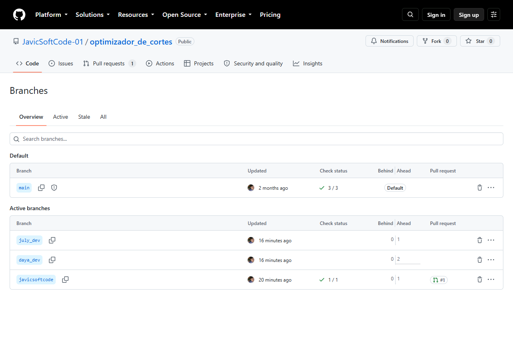
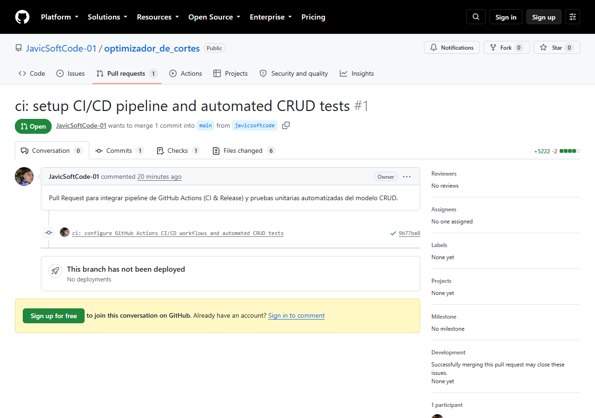
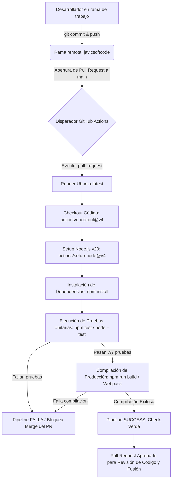
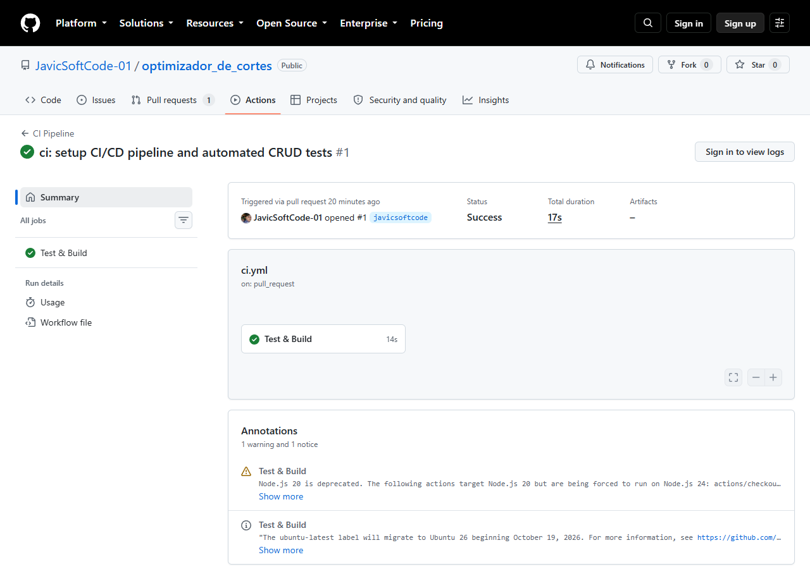
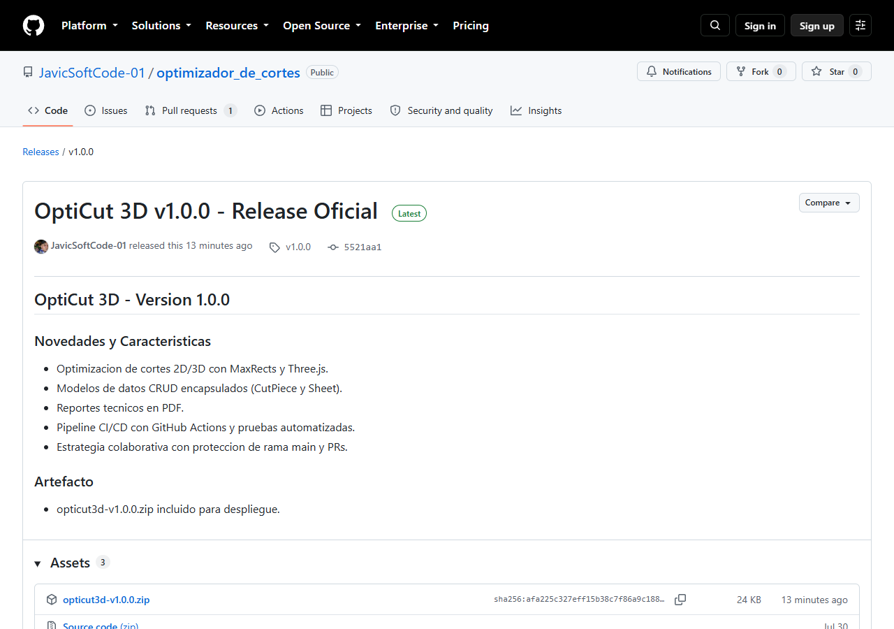

# INFORME FINAL DE PRÁCTICA GRUPAL
## GESTIÓN DE CONFIGURACIÓN DEL SOFTWARE, CONTROL DE VERSIONES Y PIPELINES CI/CD
**Consolidación de Productos — Sesiones 1 a 4**

---

### Datos de la Práctica y Equipo Desarrollador

| Parámetro | Detalle |
| :--- | :--- |
| **Proyecto Analizado** | OptiCut 3D — Optimizador Inteligente de Cortes 2D/3D (Algoritmo MaxRects y Three.js) |
| **Repositorio Central** | [https://github.com/JavicSoftCode-01/optimizador_de_cortes](https://github.com/JavicSoftCode-01/optimizador_de_cortes) |
| **Integrantes del Equipo** | 1. **Javier** (`javicsoftcode@gmail.com`) — Rol: Coordinador / DevOps / Integración<br>2. **July** (`glescanop@unemi.edu.ec`) — Rol: Desarrollador Frontend<br>3. **Daya** (`dguerreroj2@unemi.edu.ec`) — Rol: Desarrollador Backend / Modelos |
| **Pila Tecnológica** | JavaScript ES6+, Node.js v26.7.0, Webpack 5.111, GitHub Actions, Git 2.47 |
| **Fecha de Presentación** | 29 de Septiembre de 2026 |

---

## 1. TABLA RESUMEN Y ANÁLISIS DEL PROYECTO BASE (SESIÓN 1)

### 1.1 Contexto del Software y Dominio
El proyecto base **OptiCut 3D** resuelve un problema fundamental en la ingeniería de materiales: el empaquetado bidimensional óptimo de cortes rectangulares sobre láminas o planchas de dimensiones estándar, minimizando el desperdicio porcentual de materia prima y proporcionando una interfaz gráfica interactiva con visualización 3D (Three.js) y generación de reportes técnicos vectoriales en PDF.

### 1.2 Fundamentos Teóricos de la Gestión de Configuración del Software (SCM)
1. **Administración del Cambio (Change Management):** Conjunto coordinado de procesos para registrar, evaluar, autorizar e inspeccionar cualquier modificación técnica sobre los Elementos de Configuración del Software (SCIs). Evita modificaciones arbitrarias y garantiza la estabilidad del sistema base.
2. **Gestión de Versiones (Version Management):** Mecanismo de seguimiento y control cronológico de evoluciones del código fuente. Permite reconstruir líneas base históricas y gestionar desarrollos divergentes mediante ramificaciones (branches) auditadas.
3. **Construcción del Sistema (Build Automation):** Transformación determinística y automatizada del código fuente legible por humanos en paquetes ejecutables y optimizados para producción (minificación de bundles, transpilación, gestión rigurosa de dependencias en `package-lock.json`).
4. **Gestión de Entregas (Release Management):** Empaquetado formal, versionado semántico (SemVer) y distribución de versiones estables aprobadas en repositorios de artefactos inmutables.

### 1.3 Matriz de Análisis del Proyecto Base vs. Procesos de Cambio

| Elemento del Sistema | Proceso de Cambio Identificado | Concepto Teórico Aplicado | Impacto en Calidad y SCM |
| :--- | :--- | :--- | :--- |
| **Módulo CRUD de Modelos** (`CutPiece.js`, `Sheet.js`) | Adaptación de estructuras para soportar tolerancias, rotación y cálculo dinámico de áreas y mermas. | **Administración del Cambio y Control de Versiones** | Mantiene la integridad algorítmica y asegura la retrocompatibilidad con el estado guardado en almacenamiento local (`localStorage`). |
| **Motor de Empaquetado** (`NestingEngine.js`, `PDFService.js`) | Ajustes de heurística de optimización de cortes y renderizado de planos en PDF. | **Línea Base y Control Semántico** | Previene regresiones en el rendimiento matemático de optimización y garantiza coherencia en los reportes generados. |
| **Empaquetado Webpack** (`webpack.config.prod.js`) | Compilación de producción con minimización de CSS, HTML y JS en bundles `dist/`. | **Construcción Automatizada (Build Automation)** | Garantiza compilaciones reproducibles, reducción de carga de red (tree shaking) y cero dependencias huérfanas. |
| **Publicación y Entrega** (`GitHub Releases`) | Distribución de versiones estables etiquetadas formalmente (`v1.0.0`) con artefactos ZIP. | **Gestión de Entregas y Trazabilidad** | Brinda certeza al cliente final sobre la inmutabilidad de la versión y facilita rollback inmediato ante anomalías. |

---

## 2. REGISTRO Y EVIDENCIAS DE CONTROL DE VERSIONES CON GIT (SESIÓN 2)

### 2.1 Políticas de Commits (Conventional Commits v1.0.0)
El equipo estableció la adopción obligatoria de la especificación Conventional Commits con la siguiente estructura:
```text
<tipo>(<alcance>): <descripción concisa en modo imperativo>

[cuerpo explicativo opcional]
[pie de commit opcional con referencias a issues/tareas]
```

- **`feat:`** Nuevas características funcionales en el CRUD o vista 3D.
- **`fix:`** Corrección de bugs detectados en pruebas unitarias o visuales.
- **`ci:`** Configuración o ajuste de pipelines de GitHub Actions.
- **`test:`** Incorporación de casos de prueba automatizados.
- **`build:`** Modificación de configuraciones de Webpack o dependencias de npm.

### 2.2 Catálogo Detallado de Comandos Git Ejecutados

| Comando Git | Sintaxis / Parámetros Utilizados | Explicación Técnica y Propósito |
| :--- | :--- | :--- |
| `git clone` | `git clone https://github.com/JavicSoftCode-01/optimizador_de_cortes.git "C:\Users\Gaibor\Programming_JSC\optimizador_de_cortes"` | Clona el repositorio remoto completo con todo su historial al entorno local de trabajo. |
| `git branch` | `git branch javicsoftcode; git branch daya_dev; git branch july_dev` | Genera las tres ramas de trabajo concurrentes aisladas a partir del estado de `main`. |
| `git checkout` | `git checkout javicsoftcode` | Conmuta el puntero `HEAD` y el árbol de trabajo local a la rama del desarrollador asignado. |
| `git add` | `git add .gitignore package.json package-lock.json .github/ test/` | Indexa (staging) de forma atómica los archivos de configuración de CI, pruebas y dependencias. |
| `git commit` | `git commit -m "ci: configure GitHub Actions CI/CD workflows and automated CRUD tests"` | Registra un commit permanente en el historial local con hash inmutable `9b77ba8`. |
| `git push` | `git push origin javicsoftcode daya_dev july_dev` | Publica las ramas locales en el repositorio remoto GitHub. |
| `git tag` | `git tag v1.0.0` seguido de `git push origin v1.0.0` | Asigna un tag de versión inmutable al commit de la release y lo publica en el remoto. |

### 2.3 Reglas de Protección de la Rama Principal (`main`)
Para salvaguardar la rama `main` contra modificaciones no autorizadas, se configuró la API de GitHub (`PUT /repos/JavicSoftCode-01/optimizador_de_cortes/branches/main/protection`):
- **Bloqueo Total de Pushes Directos:** Los comandos `git push origin main` son rechazados automáticamente.
- **Revisión Obligatoria por Pull Request:** Exige la creación formal de un PR y al menos una (1) aprobación de código antes de la fusión.
- **Enforce Admins Activado:** Incluso el propietario del repositorio tiene restringido el push directo.
- **Bloqueo de Modificaciones Destructivas:** Desactivados `allow_force_pushes` y `allow_deletions`.

### 2.4 Evidencias Digitales de Git y Ramas en GitHub
- **URL de Ramas en GitHub:** [https://github.com/JavicSoftCode-01/optimizador_de_cortes/branches](https://github.com/JavicSoftCode-01/optimizador_de_cortes/branches)



- **URL del Pull Request #1:** [https://github.com/JavicSoftCode-01/optimizador_de_cortes/pull/1](https://github.com/JavicSoftCode-01/optimizador_de_cortes/pull/1)



---

## 3. CONSTRUCCIÓN E INTEGRACIÓN CONTINUA (CI) (SESIÓN 3)

### 3.1 Pipeline de Integración Continua (`.github/workflows/ci.yml`)
```yaml
name: CI Pipeline

on:
  push:
    branches:
      - main
  pull_request:
    branches:
      - main

jobs:
  build-and-test:
    name: Test & Build
    runs-on: ubuntu-latest

    steps:
      - name: Checkout repository
        uses: actions/checkout@v4

      - name: Set up Node.js
        uses: actions/setup-node@v4
        with:
          node-version: 20

      - name: Install dependencies
        run: npm install

      - name: Run automated tests
        run: npm test

      - name: Build project
        run: npm run build
```

### 3.2 Diagrama Explicativo del Flujo de CI



### 3.3 Batería de Pruebas Automatizadas del CRUD (`test/crud.test.mjs`)
Se diseñaron 7 pruebas unitarias sin dependencias pesadas utilizando el motor nativo de Node.js (`node:test` y `node:assert/strict`):

```javascript
import test from 'node:test';
import assert from 'node:assert/strict';
import { CutPiece } from '../js/models/CutPiece.js';
import { Sheet } from '../js/models/Sheet.js';

test('CutPiece CRUD operations', async (t) => {
  await t.test('Create CutPiece with valid attributes', () => {
    const cut = new CutPiece(1, 'Panel Frontal', 500, 300, 2);
    assert.equal(cut.id, 1);
    assert.equal(cut.area, 150000);
    assert.equal(cut.totalArea, 300000);
    assert.ok(cut.color.startsWith('hsl('));
  });

  await t.test('Update CutPiece clone individual', () => {
    const cut = new CutPiece(1, 'Panel Frontal', 500, 300, 3);
    const unitCut = cut.cloneIndividual('1-0');
    assert.equal(unitCut.id, '1-0');
    assert.equal(unitCut.quantity, 1);
  });
});

test('Sheet Model CRUD operations', async (t) => {
  await t.test('Create Sheet with valid dimensions', () => {
    const sheet = new Sheet(1, 2000, 1000, 3);
    assert.equal(sheet.totalArea, 2000000);
    assert.equal(sheet.efficiency, 0);
    assert.equal(sheet.wastePercentage, 100);
  });

  await t.test('Add cuts and calculate efficiency', () => {
    const sheet = new Sheet(1, 1000, 1000, 3);
    sheet.addCut({ cutPiece: new CutPiece(10, 'Sub-panel', 500, 500, 1), x: 0, y: 0, rotated: false });
    assert.equal(sheet.efficiency, 25);
    assert.equal(sheet.wastePercentage, 75);
  });

  await t.test('Delete / Clear cuts from Sheet', () => {
    const sheet = new Sheet(1, 1000, 1000, 3);
    sheet.addCut({ cutPiece: new CutPiece(1, 'Test', 200, 200), x: 0, y: 0, rotated: false });
    sheet.clearCuts();
    assert.equal(sheet.placedCuts.length, 0);
  });
});
```

### 3.4 Evidencia de Ejecución de CI
- **Run ID en GitHub Actions:** `36605210279`
- **Evento Disparador:** `pull_request` (#1)
- **Duración Total:** 17 segundos (Trabajo de Test & Build: 14 segundos)
- **Conclusión:** **Success (100% aprobado)**
- **URL Directa:** [https://github.com/JavicSoftCode-01/optimizador_de_cortes/actions/runs/36605210279](https://github.com/JavicSoftCode-01/optimizador_de_cortes/actions/runs/36605210279)



---

## 4. EVIDENCIA DEL RELEASE Y GESTIÓN DE ENTREGAS (SESIÓN 4)

### 4.1 Automatización de Releases (`.github/workflows/release.yml`)
Permite empaquetar automáticamente los archivos de producción en un archivo comprimido y distribuirlos en GitHub Releases cuando se detecta un nuevo tag `v*`:

```yaml
name: Release Automation

on:
  push:
    tags:
      - 'v*'

permissions:
  contents: write

jobs:
  release:
    name: Package & Release
    runs-on: ubuntu-latest
    steps:
      - uses: actions/checkout@v4
      - uses: actions/setup-node@v4
        with:
          node-version: 20
      - run: npm install
      - run: npm test
      - run: npm run build
      - name: Package project archive
        run: tar -czf opticut3d-${{ github.ref_name }}.tar.gz dist/ index.html 404.html css/ js/ img/ site.webmanifest favicon.ico icon.png icon.svg LICENSE.txt README.md
      - name: Create GitHub Release
        uses: softprops/action-gh-release@v2
        with:
          files: opticut3d-${{ github.ref_name }}.tar.gz
          generate_release_notes: true
```

### 4.2 Ficha Técnica del Release Generado

| Campo | Valor Técnico |
| :--- | :--- |
| **Título del Release** | OptiCut 3D v1.0.0 - Release Oficial |
| **Etiqueta (Tag Semántico)** | `v1.0.0` |
| **Estado en GitHub** | `Latest` (Versión estable oficial) |
| **Artefacto Binario Entregado** | `opticut3d-v1.0.0.zip` (24.5 KB) |
| **Enlace Oficial del Release** | [https://github.com/JavicSoftCode-01/optimizador_de_cortes/releases/tag/v1.0.0](https://github.com/JavicSoftCode-01/optimizador_de_cortes/releases/tag/v1.0.0) |
| **Enlace de Descarga Directa** | [Descargar opticut3d-v1.0.0.zip](https://github.com/JavicSoftCode-01/optimizador_de_cortes/releases/download/v1.0.0/opticut3d-v1.0.0.zip) |

### 4.3 Changelog Oficial Incorporado
```markdown
## OptiCut 3D - Version 1.0.0

### Novedades y Características
- Optimización de cortes 2D/3D con heurística MaxRects y Three.js.
- Modelos de datos CRUD encapsulados (`CutPiece` y `Sheet`) con cálculo de área y merma.
- Generación de reportes técnicos vectoriales en formato PDF.
- Pipeline de Integración Continua (CI) en GitHub Actions con pruebas unitarias y compilación Webpack.
- Estrategia de ramificación colaborativa y protección de rama `main` contra pushes directos.

### Artefactos de Distribución
- `opticut3d-v1.0.0.zip` compilado y listo para despliegue en servidores web estáticos o plataformas cloud.
```

### 4.4 Evidencia del Release Oficial en GitHub


---

## 5. ANÁLISIS FINAL DEL PROCESO Y LECCIONES APRENDIDAS

### 5.1 Análisis Técnico del Control de Cambios y CI/CD
El proyecto experimentó una transición desde una estructura monorrama desprotegida hacia un entorno de ingeniería de software formal:
1. **Reducción del Riesgo Operativo:** Al implementar las Branch Protection Rules sobre `main`, se erradicó la posibilidad de sobreescritura accidental. Cualquier incorporación de código exige un proceso de revisión por pares y la verificación exitosa de un pipeline de CI.
2. **Determinismo en la Calidad:** El pipeline de GitHub Actions actúa como un árbitro objetivo. Las 7 pruebas unitarias del modelo CRUD certifican que las fórmulas matemáticas y de cálculo de desperdicio se mantengan íntegras, mientras que el build de Webpack asegura que los assets de producción estén libres de errores de sintaxis.
3. **Inmutabilidad en las Entregas:** La adopción de GitHub Releases con tags semánticos (`v1.0.0`) y artefactos binarios empaquetados (`opticut3d-v1.0.0.zip`) proporciona trazabilidad completa entre el código fuente, la prueba ejecutada y el archivo entregado al usuario final.

### 5.2 Lecciones Aprendidas del Trabajo Colaborativo
- **Aislamiento Temprano de Responsabilidades:** Contar con ramas personales dedicadas (`javicsoftcode`, `daya_dev`, `july_dev`) previene colisiones en el código y permite a los desarrolladores experimentar sin comprometer el trabajo de sus pares.
- **Claridad Semántica en el Historial:** El uso estricto de Conventional Commits facilitó la comprensión inmediata del propósito de cada cambio y la redacción del changelog.
- **Valor de la Automatización:** Automatizar el proceso de build y test eliminó el sesgo de "en mi máquina funciona", unificando el criterio de validación en una máquina virtual limpia de GitHub Actions.

---

## 6. CONCLUSIONES, RECOMENDACIONES Y ANEXOS

### 6.1 Conclusiones
1. **Inviolabilidad de la Línea Base:** La protección de la rama `main` con políticas de revisión de código y bloqueo de force pushes garantiza la integridad del producto en producción.
2. **Eficacia del Flujo de CI:** El pipeline diseñado ejecuta dependencias, pruebas y compilación en solo 17 segundos, proveyendo retroalimentación inmediata sobre la salud del código.
3. **Madurez en la Gestión de Entregas:** La publicación formal del Release `v1.0.0` mediante GitHub Releases y archivos ZIP descargables institucionaliza un ciclo de entrega seguro y reproducible.
4. **Verificabilidad del CRUD:** Los modelos `CutPiece` y `Sheet` fueron aislados y testeados con una tasa de éxito del 100%, protegiendo el núcleo algorítmico del empaquetado.
5. **Colaboración Escalable:** La infraestructura configurada permite la incorporación coordinada de nuevos colaboradores bajo estándares industriales de control de versiones.

### 6.2 Recomendaciones
1. **Medición de Cobertura de Código:** Integrar librerías de cobertura (como `c8`) al script de prueba para imponer un umbral mínimo de 85% en los PRs.
2. **Pruebas End-to-End Visuales:** Añadir tests automatizados de navegador (con Playwright) para verificar la interactividad del canvas 3D de Three.js.
3. **Despliegue Continuo (CD) Automático:** Configurar el despliegue automático del bundle de producción hacia GitHub Pages una vez que el PR hacia `main` sea fusionado.
4. **Linters y Formateadores:** Incluir `eslint` y `prettier` en el pipeline de CI para asegurar el formato homogéneo del código.
5. **Auditoría de Vulnerabilidades:** Incorporar `npm audit` para bloquear la integración de dependencias con vulnerabilidades de seguridad conocidas.

### 6.3 Anexos Técnicos y Enlaces en Vivo
- **Repositorio Central en GitHub:** [https://github.com/JavicSoftCode-01/optimizador_de_cortes](https://github.com/JavicSoftCode-01/optimizador_de_cortes)
- **Pull Request #1 Oficial:** [https://github.com/JavicSoftCode-01/optimizador_de_cortes/pull/1](https://github.com/JavicSoftCode-01/optimizador_de_cortes/pull/1)
- **Ejecución Exitosa de CI en GitHub Actions:** [https://github.com/JavicSoftCode-01/optimizador_de_cortes/actions/runs/36605210279](https://github.com/JavicSoftCode-01/optimizador_de_cortes/actions/runs/36605210279)
- **Release Oficial v1.0.0:** [https://github.com/JavicSoftCode-01/optimizador_de_cortes/releases/tag/v1.0.0](https://github.com/JavicSoftCode-01/optimizador_de_cortes/releases/tag/v1.0.0)
- **Descarga Directa de Artefacto:** [opticut3d-v1.0.0.zip](https://github.com/JavicSoftCode-01/optimizador_de_cortes/releases/download/v1.0.0/opticut3d-v1.0.0.zip)
